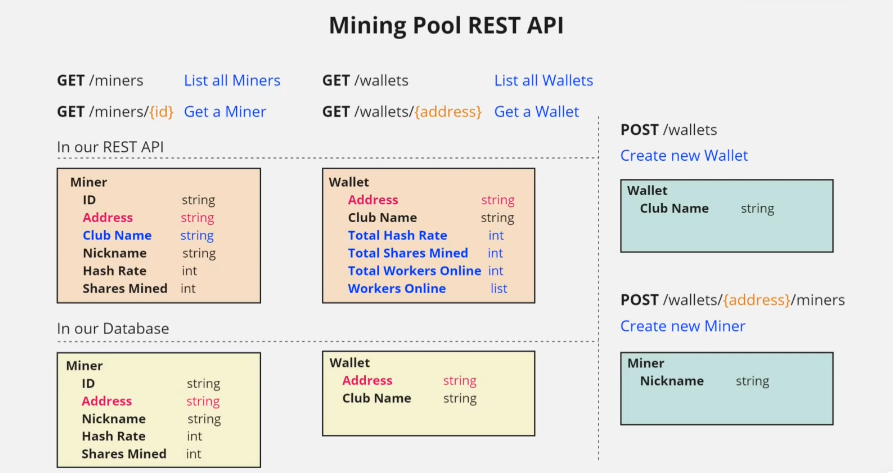

# A fully-functional REST API for a crypto-mining pool

## This project combines everything learned from:

- [explore-the-maze](../explore-the-maze/)
- [node-info-app](../node-info-app/)

## Application Flow:

## Libraries used:

- **tokio** - runtime library for writing asynchronous applications in Rust, providing the necessary tools to handle concurrent I/O operations and multithreading efficiently.
- **reqwest** - high-level, ergonomic HTTP client for Rust, designed to simplify making HTTP requests to APIs.
- **serde** - a framework for serializing and deserializing Rust data structures efficiently and generically.
